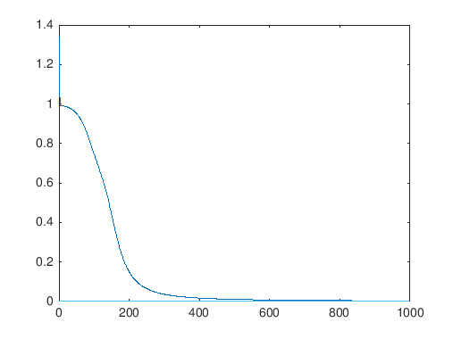
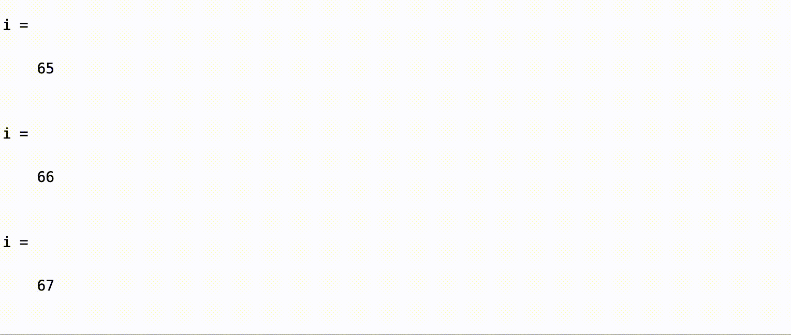

# Says One Neuron To Another
*EECS738*

## Authors
[Gage Benne](https://www.gagebenne.com) and [Andy Monroe](https://www.andymonroe.dev)

# Introduction
After researching various Neural Network implementations, we opted to begin our endeavor into machine learning with neural networks with a simple two layer neural network.  We first began by learning on a simple binary input, two weights, and a classical Sigmoid activation function.  Originally we both had experience in MatLab and wanted to implement a novel implementation there.  Unfortunately, we weren't getting quite the results we wanted, and tweaking our implementation meant training the neural network...  Which we quickly discovered MatLab wasn't anywhere as fast as other languages we were used to, and by a long shot.  With that in mind we transitioned to experimenting in C++, just about as close to assembly code as one can get in terms of speed, and just about as *far* away from MatLab as one can get as well.

# Process
Our general approach was similar in MatLab and C++.  A simple two layer neural network began with a class definition involving the usual definitions: input, weights (two), output.  In order to train the neural network, each iteration involved calculating the predicted output (feedfoward), then updating the two weights we had (backpropagation).  In order to evaluate how our predictions went we used the generic sum of squares error as our loss function; the loss is propagated back and used to update our weights.  The amount to adjust the weights was determined by the Sigmoid derivative.  After this, we added a simple loss per iteration identifier (which we should hopefully see decrease towards some constant).  With this we used several datasets to test our basic neural network, first being a simple binary input layer, then a Sine input, and lastly a dataset which we used previously: the Iris dataset.

## MatLab
Usually used as more of a script-esque language, we first needed to implement our neural network class utilizing MatLab's class structure.  With the simple training data, we saw optimistic results in the beginning with our overall error decreasing at a good rate.

However, when expanding the abilities toward larger datasets we experienced less than ideal situations, one of which being extremely slow train times.  This was expected, but ended up being more extreme than initially thought.  When testing datasets such as the irises as input, we experienced inconsistent error reduction.  At times it would perform and resolve just as with the simple training data, but other times the error wouldn't change.  Despite possibly being a small error in our code, or and issue with our random initial weights, we knew it was too difficult to tweak the code in a time conscious manner, so we moved on from our MatLab environment.

## C++
After our previous attempt, we knew we wanted something quick, so we went with C++ as our language of choice.  We implemented a very similar code structure, with a notable addition of C++ macros so that we could perform all operation on the stack and speed up our learning algorithm immensely.  While it outperformed a heap implementation, and definitely outperformed MatLab, it is at the cost of manually determining the size of the arrays we would need for the input we chose, as the compiler would need to know all of this at compile time.  It was also somewhat of a challenge to convey a simple matrix multiply in C++ without any libraries, something MatLab was obviously seamless with.

## Python
We also tried an implementation in good ol' Python to see differences in adding one more layer or additional nodes in a flexible manner.

# Results
Eventually we wanted to add a few more layers, and a few more nodes.  All in all we were relatively satisfied with the results we were able to achieve, achieving a sensible root means square error of less than 1 on several passes, thus achieving a fairly accurate prediction on the iris dataset.  We look to expand our datasets to see if things still work out with less ideal training data.
